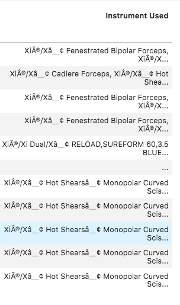
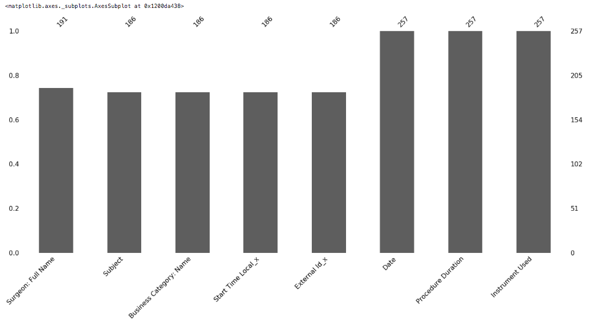
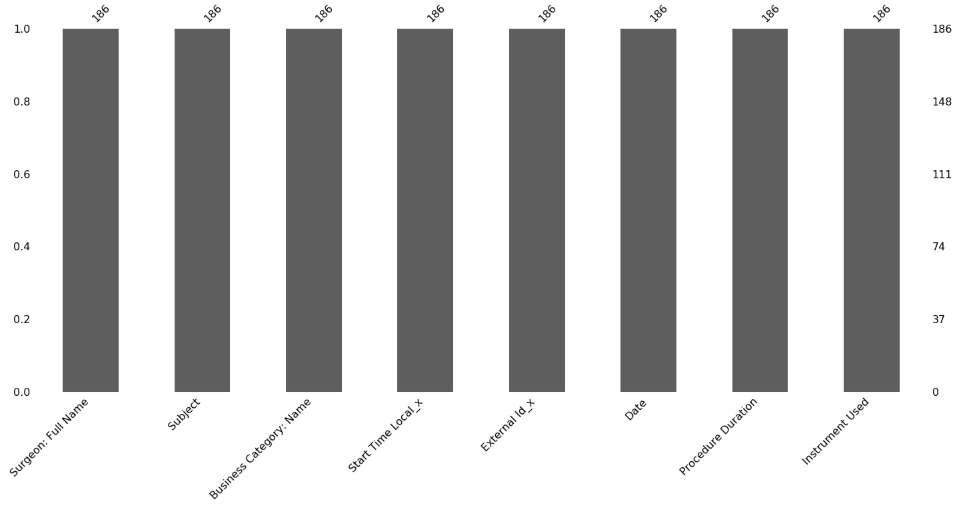

# Medical Reporting 
Surgeons use medical robotics to performe surguerys. Data is collected via the robot and manual data by the surgeon to the reports are then used in medical purchasing. 

## Issues to solve:
- [] Merge two reports from interal client portal and Salesforce reporting, where consitently there is data missing due to either malfunction in the client portal data or human error. If the the client portal is not linked to the hopspital the surgeoun must manually plug in to the robotics machine for the correct data to be logged. Futhermore, if a case is not updated in salesforce the information is not linked and often deleted.

- [] Current process involves using an excel spreadhsheet using macro to upload the data and drop nulls. However, the process is lengthy and often done manually. There are multiple hospitals and different locations.

## Recommendations/Possible Solutions to Evaluate
1.  [] Python, Pandas, associated libraries to pull, clean and merge data.  
2. [] Create a dashboard for reporting.
2. [] Additionsal SQL Database for all hospitals that use the robotics system to merge the data frames and retain data for more dymaic long term reporting.
3. [] Further build out the API with salesforce and look into creating a seperate database for the CP information (othefr than SQL mentioned). 
4. [] Another recomendation was to map out the flow of the surgeons tools within the salesforce CRM software, create a mandatory field in their dashboards, with a picklist associated to case reporting. Thus, all data can be captured with other oppurtunities and billing for further reporting. As well as, ensure that cases are not missing any data via mandatory reporting settings. 
5. [] Also noted, that information from those files could be used to capture further metrics, such as surgeon turn around time and cases processed. If the information is uploaded into salesforce further realtionships can be created.  


## Recommendation 2: Python Steps 
- [x] Load in and clean data. Salesforce data and internal systems data from Davinci Client Portal.
- [x] Drop unecesary columns. 
    - [x] Minimum columns: Date, Start Time and External ID as primary keys/ Instruments Used as primary data for analysis on purchasing. 
- [x] Figure where missing data is located using Missingo package to verify data.
- [x] Drop all nulls.
- [x] Create dynamic reports (need to discuss meaningful charts).

### Issues I faced: 
- Ran into issues of unicode when loading in the data due to the Xi numbers, passed in Unicode command. 


```javascript
_CP_DF = pd.read_csv(_CP_Path, header=0,encoding = 'unicode_escape')
Drop unusued columns 
```

- Upon merge Still created x,y columns, creating an extra step to merge another columns to match must drop again. (Unsure if better solution here - to reasearch) Transfer to sequal with CSV. 

    export_csv = _Combined_DF.to_csv (r'_Clean.csv', index = None, header=True)


<details><summary>Import libraries and dependencies</summary><br>

## Import Statements
```javascript
import pandas as pd
from pathlib import Path
import pandas as pd
import numpy as np
import datetime as dt
from pathlib import Path
import os
import matplotlib.pyplot as plt
import hvplot.pandas
import plotly.express as px
import matplotlib
import panel as pn
from panel.interact import interact
from panel import widgets
import matplotlib
import missingno as msno
import pandas as pd
import hvplot.pandas
from sqlalchemy import create_engine
from pandas.io.json import json_normalize
get_ipython().run_line_magic('matplotlib','inline')
```
</details>

## Data Clean-Up
#### Set Relative Paths:
```javascript
_CP_Path = Path('CSVPATH.csv')
_SFDC_Path = Path('CSVPATH.csv')
```

#### Open Customer Portal Data:
"Unicode Escape" fixes error due to syntax type in Instruments Used column.

```javascript
_CP_DF = pd.read_csv(_CP_Path, header=0,encoding = 'unicode_escape')
_CP_DF.columns = (['Date', 'Start Time Local','External Id','Procedure Duration','Instrument Used'])
```

#### Open Customer Portal Data and Rename Columns:

```javascript
_CP_DF = pd.read_csv(_CP_Path, header=0,encoding = 'unicode_escape')
_CP_DF.columns = (['Date', 'Start Time Local', 'External Id', 'Procedure Duration', 'Instrument Used'])


```

#### List to see columns:
```javascript
list(_CP_DF)
```

#### Read in Salesforce Data:
```javascript
SFDC_Data = pd.read_csv(...Path.csv,header=0,encoding = 'unicode_escape')
```

#### Merge Dataframes using right_index:
For the data to correctly join, extral columns are added to ensure mapping. Thus, we must drop those duplications. 

```javascript
_Combined_DF = pd.merge(_SFDC_DF,_CP_DF, how = 'right', right_index=True, left_index=True)\n",
_Combined_DF.drop(['External Id_y','Start Time Local_y', 'Procedure Date (Local)'], axis=1, inplace=True)\n",
_Combined_DF.set_index('Date')
```

#### Use Missingo to visulise missing data
White area represents missing data.  
```javascript
msno.bar(_Combined_DF)
```




#### Drop Null values:

```javascript
_Combined_DF.dropna(inplace=True)
```


#### Ensure Null values droped:
```javascript
msno.bar(_Combined_DF)
```
